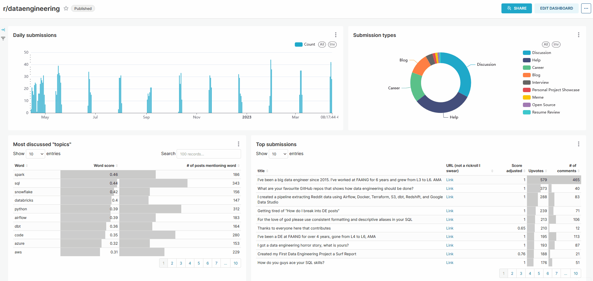
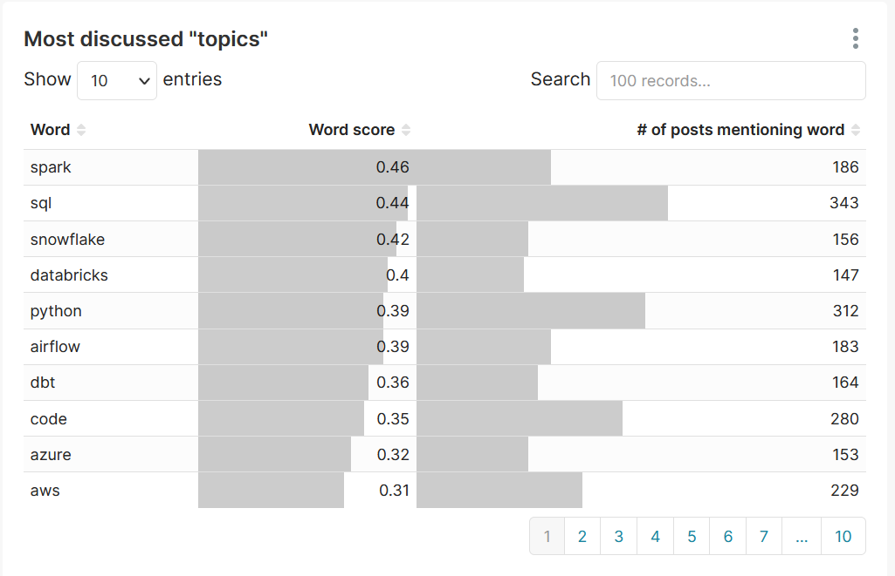

<!-- markdownlint-disable MD012 MD033 MD028 MD029-->
# Subreddit analytics

- [Why tho](#why-tho)
- [Getting started](#getting-started)
- [Outputs](#outputs)

TL;DR: This project was built to analyze the subreddit "r/dataengineering", but can be used to pull and analyze data from any subreddit (as long as Pushshift API is alive).

## Why tho

When I'm not debugging data pipelines I spend a lot of time reading how other engineers debug data pipelines on the dataengineering subreddit. I'm fun at parties I swear.

<p align="center">

</p>
<p align="center"><i>Day in the life of a data engineer</i></p>

I thought it would be a fun project to pull data from said subreddit and run some analysis on it. Very meta I know.

The gist of it is as follows:

1. Use [Pushshift](https://github.com/pushshift/api) with [PMAW](https://github.com/mattpodolak/pmaw) to get as many submission (post) IDs as possible.
2. Once the list is obtained, use [asyncpraw](https://github.com/praw-dev/asyncpraw) get pull data for each submission found, as well as all their comments.
3. Perform some minor cleaning and persist said data in DuckDB. Why DuckDB? Because I wanted to try it. Also it makes it more convenient to handle upserts w.r.t. parquet files stashed somewhere.
4. Take the 2 tables stored in DuckDB and upload them to BigQuery.
5. Use dbt to model this data and perform some poor man's NLP shenanigans.
6. ????
7. Profit.

The end result is [this dashboard](https://tinyurl.com/dataengineering-analytics). The most interesting part is the "Top submissions" widget. It shows a list of all the submissions pulled ordered by upvotes, but if filtered by "topic", it will show the most interesting submissions pertaining to that topic.

🟢 Try playing with the "Topic" filter on the left and see how the "Top submissions" widget changes!

---

⚠️ **2023-04-26** - The dashboard will stay up for roughly 3 months or until I run out of GCP credits, whichever expires first.



> **Note**
> You will notice that a lot of submissions are missing. This is because Reddit's API doesn't allow the user to query over a range of time, so if one wants, say, find all the submissions for the last year in a specific subreddit, they can't using the official API.
> The only way is to use Pushshift, but since it's a free service maintained by a single individual in their free time, completeness of results cannot be guaranteed.

## Getting started

1. Setup Google stuff

- You first need to create a Reddit APP. You can find instructions [here](https://github.com/reddit-archive/reddit/wiki/OAuth2-Quick-Start-Example#first-steps).
- Then you need to create a [Google Cloud Platform project](https://console.cloud.google.com/cloud-resource-manager) and set up a service account with the permission "BigQuery Admin". Create a key for this account and save it somewhere safe.
- Install the [Google Cloud SDK](https://cloud.google.com/sdk/docs/install-sdk) and run:

```bash
gcloud auth activate-service-account --key-file <path_to_your_credentials>.json
gcloud auth application-default login
```

2. Setup the repo

- Clone the repo locally, and next to `.env.example` create a `.env` file which you will fill with the info from your Reddit App and your GCP project.
- Install all the dependencies and activate your environment with:

```bash
poetry install
poetry shell
```

3. Create the infrastructure

Now it's time to setup the infrastructure. Install terraform with:

```bash
brew install terraform
```

Then:

```bash
cd terraform/
terraform init
terraform plan
terraform apply
```

Terraform will ask you the ID of your GCP project. You can get it easily by running:

```bash
gcloud projects list
```

4. Run the pipeline!

Set up a free account with [Prefect](https://app.prefect.cloud/auth/login), then login in your shell with:

```bash
prefect cloud login
```

After you're done, you need to create the necessary blocks before running the pipeline:

```bash
python prefect/blocks.py
```

Finally, run the pipeline:

```bash
python prefect/flows_api_to_bq.py --refresh true
```

> **Note**
> You can get a list of accepted params by running
>
> ```bash
> python prefect/flows_api_to_bq.py --help
> ```

By default, the pipeline will reuse the IDs saved in `assets/post_ids.csv`. To try and use Pushshift API, open [flows_api_to_bq.py](prefect/flows_api_to_bq.py), comment line 28 and un-comment line 27.

You will see loads of logs being printed in the console. That's fine, it means it's running. Since the pipeline is async, there are lots of tasks running concurrently.

If you used the saved post IDs, it should take about 3-4 minutes to complete.

5. Build dbt models

Once the pipeline has finished running, you can build the dbt models:

```bash
cd dbt/
dbt build
```

## Outputs

The following tables have been used for analysis:

- int_submissions_score_adjusted

A table with all submissions' data pulled by the pipeline, containing info such as number of comments, upvotes, submission text etc. The `score_adjusted` field is calculated for each submission by taking in consideration the number of comments and upvotes with respect to all the dataset, accounting for outliers. It ranges between 0 and 1 and represents how "hot" a submission is.

- tfidf_submissions_and_comments

[TF-IDF](https://en.wikipedia.org/wiki/Tf%E2%80%93idf) score for each word in each document, where a document is a concatenation of a submission's body + all its comments.

- dim_words

A vocabulary meant to represent the most relevant and hot topics across all `r/dataengineering` subreddit. The `word_score` is computed by summing the product of each word's TF-IDF value times its corresponding submission `score_adjusted`. Which in the context of TF-IDF is kind of an anti-pattern, but it gives satisfactory results.

<p align="center">

</p>
